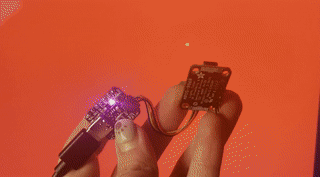

### TODO:

You can now actually measure the timings you modeled in the last lab. Add APDS9960 support to your sensor, then set your system up to capture the following timing info:
- color packet delivered to PIO module
- bit delivered to WS2812 (24x/packet)
- full packet delivered to WS2812
- brightness changed on APDS

Run this experiment in both dark and light room settings (record initial ambient brightness in each case). The Neopixel should start 'off' and the ADPS9960 should be initialized with your preferred sampling rate (you may want to try a few different rates). Run the experiment for at least 100 samples at brightness settings of 0%, 25%, 50%, 75%, 100% (making sure to give the ADPS reading enough time to 'settle' each time Neopixel is turned off).

Report the observed 'jitter' based on misalignment with the free-running PWM module on the WS2812.

### Logic:
- color packet delivered to PIO module
    1. APDS9960 -color packet/I2C-> RP2040 -> buffer
- bit delivered to WS2812 (24x/packet)
    - start recording
- full packet delivered to WS2812
    - end recording
- adjust brightness value with given value
    - read the record from buffer
    - change the value of brigheness with desired ratio
- brightness changed on APDS neopixel 
    1.RP2040 -I2C-> APDS neopixel

### Status:
Compelete

### Results:

1. Color change  

2. Observed 'jitter' (use another RP2040 and run code `pioscope.c` in folder `pioscope` to detect the SDA and SCL)

